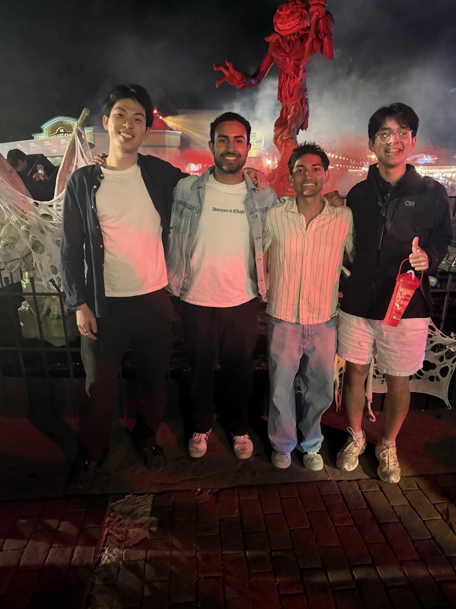

Hi everyone, welcome to our newsletter! We're planning to write about what we've been up to every week so you all can stay updated on what's been going on in our lives.

This is the start of the first week that Suhaas and I are working full-time on our startup. Here's a quick list of things we've done recently:

- Created a landing page for Cerebellum: [usecerebellum.com](https://usecerebellum.com)
- Wrote a [whitepaper](https://www.usecerebellum.com/whitepaper/) on what we're building
- Recorded a [demo video](https://youtu.be/YwLkXPcV2pQ) of Cerebellum
- Recorded a [founder video](https://youtu.be/-ztevn9FLHE) for applications
- Applied to the 16VC and PearX accelerators

## Who we talked to

We spent a lot of the week on calls with founders and builders in the AI space. Here's a quick overview of the conversations we had and what we learned:

- **Aayush Gupta (Driftwood).** Aayush was generous with advice from building his own company. The big lesson was to validate that people will pay before building too much, and that warm intros and in-person conversations get you much further than cold outreach.
- **Hiltin Guo (AiriWheels).** Hiltin joined us right after shipping an urgent feature for a customer (the team had been testing until 3am). We talked about where custom models could help them, and about starting with data that isn't sensitive.
- **Aryan Singhal (Mirrors).** Aryan pushed back in a useful way: many companies are still happy calling frontier models, and fine-tuning tends to happen in bursts rather than continuously. He offered to introduce us to others in the space.
- **Rajit Khanna.** Rajit has pivoted before, and his advice was to find customers who are really unhappy with what they use today before building anything.
- **Vedant Gaur (Latent).** Latent monitors model behavior during inference, which fits nicely next to what we're doing. His outreach tip: offer something small and free up front.
- **Dhanasree Rao (Turing).** Dhanasree helped us find the right people to talk to about fine-tuning at Turing.

## Events

- **Specialized models meetup (Sep 29).** The theme was that training your own model is worth it when the task is narrow and stable and you have good data, good evals and a clear economic case. Our favorite example was Vercel's v0 team fine-tuning a small model to fix code syntax that ran 40x faster than GPT-4o.
- **Future of Work: Agent Driven, by Turing Growth (Oct 1).** Airtable talked about what makes AI agents useful in practice. Their advice was to start with tasks where mistakes are forgivable and keep a human in the loop for anything higher stakes.

## What's coming up

Suhaas and I are focusing on outreach and building credibility in the space. Look out for some posts from us about research we've been doing on model distillation! We're also pushing to talk to more people in this space to learn about AI companies' problems and to find more design partners.

## Other stuff

We surprised Suhaas for his 25th birthday by going to Six Flags!

