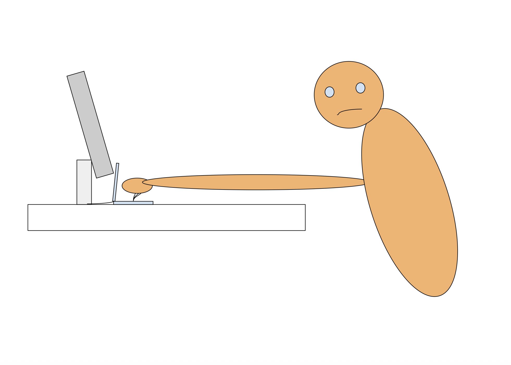

A new guy started working on my floor at Datadog. I don’t know if he is new to the company or if he just moved to our floor. His desk setup is so uncomfortable I got annoyed even looking at it. He had one monitor, a magic mouse and no keyboard. Since he doesn’t have a keyboard he has to leave his laptop open in order to type. This would be fine but the issue is that the cord to connect the laptop is so short that when the laptop is connected, it can’t even be opened completely because it is too close to the monitor. So the guy has to reach deep into the desk to type, fingers practically hitting the half-open screen. It’s an incredible scene, you cannot miss it.

_the setup (my friend Leon drew this masterpiece)_

I immediately started judging this guy. I wondered how this person could withstand staying in this uncomfortable position without making any effort to change it. It’s astonishing because there are so many solutions to alleviate the problems and they are all so easy. He can obtain a keyboard, he can request a longer cord for his monitor, he can request a monitor stand, he can even move the monitor closer to the edge of the desk so he doesn’t have to reach so far. I can only think of three potential reasons for why he isn’t making a change. (1) he is too lazy to walk to get a keyboard or rearrange his desk (2) he is unwilling or feels uncomfortable asking things from other people (3) he is genuinely fine with his current desk setup. In the moment when I saw this I assumed it was a combination of (1) and (2) and I was left thinking “this guy is missing out on so much in his life. Who knows what his life could be if he just did things?”

Then I started judging myself. Are there people who would view me the way I view the guy with the stupid desk setup? I want to create great products to help people reach their potential, and I want to create an enduring business so I can do this for the rest of my life. For that to happen, people need to know we exist. And the ways to make that happen are as obvious as walking twenty feet to grab a keyboard: show up where our users hang out, post what we believe, talk to people. Instead I’ve drafted tweets and deleted them. I’ve flaked on builder events and worked at home. The reluctance doesn’t come from laziness, it is some kind of fear. I’m a (2). It was tough to name what exactly I’m afraid of but I believe there are two core fears. The first is the feeling that what I have to say isn’t good enough or original enough to be worth anyone’s time. I don’t want to be annoying. The second is that no one will care. It’s funny because these two fears contradict each other: one assumes everyone is paying attention, the other assumes no one is. We have to overcome this internal resistance and try everything that could work without fear. Otherwise we will grow old and look back on our life and think “damn, we were just like stupid desk setup guy.”

This week we actually did things. Went to events, talked to strangers, posted and it was nowhere near as difficult as I imagined it to be. That’s why I’ve written this story down. So I can revisit this whenever I feel the Resistance.
